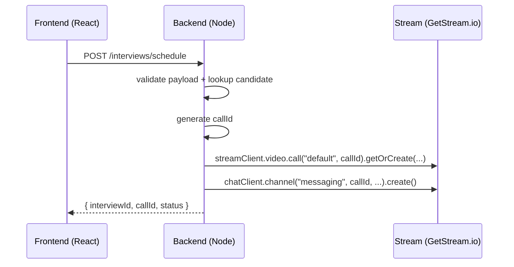
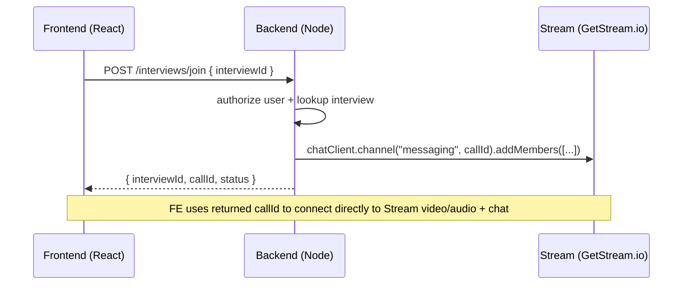

# System Design: Stream Video/Audio Call Integration

This document explains how the **CodeHuddle Remote Coding Interview Platform** integrates with **Stream (GetStream.io)** to provide **video/audio calling** and **messaging** for interview sessions.

---

## 🔧 Key Components

- **Frontend (React)**
  - Calls backend APIs to schedule/join interviews.
  - Uses a `callId` to connect to Stream's Video/Audio call and chat channel.

- **Backend (Node/Express)**
  - Manages interview lifecycle and stores interview metadata in MongoDB.
  - Uses **Stream SDKs** to create and manage:
    - **Video Call sessions** (`@stream-io/node-sdk`)
    - **Chat channels** (`stream-chat`)
  - Keeps Stream API credentials in environment variables:
    - `STREAM_API_KEY`
    - `STREAM_SECRET_KEY`

- **Stream Platform (third-party)**
  - Hosts real-time video/audio call infrastructure.
  - Hosts real-time chat messaging.
  - Manages call session state and RTC connection negotiation.

---

## 🧠 Data Model & IDs

### Call ID
- The backend generates a unique `callId` when scheduling an interview.
- `callId` is used consistently across Stream video calls and chat channels.

Example from backend:
```js
const callId = `interview_${Date.now()}_${Math.random().toString(36).substring(7)}`;
```

---

## 🔁 Flow: Schedule Interview (Create Stream Session)

### Sequence (high-level)

1. **Scheduler (Interviewer/Admin)** calls backend `/interviews/schedule` endpoint.
2. Backend:
   - Validates candidate exists.
   - Creates interview record in MongoDB.
   - Generates a unique `callId`.
   - Creates a Stream **Video Call** session.
   - Creates a Stream **Chat Channel** tied to the `callId`.
3. Returns interview info to frontend (`interviewId`, `callId`, `status`).

### Backend code responsible
- `backend/src/modules/interviews/interview.service.js` -> `scheduleInterview()`
- `backend/src/config/stream.js` (Stream SDK setup)

### Mermaid Sequence



---

## 🔁 Flow: Join Interview (Connect to Call + Chat)

### Sequence (high-level)

1. **Candidate / Interviewer** opens interview room UI.
2. Frontend calls backend `/interviews/join` with `interviewId`.
3. Backend:
   - Validates that the user is a participant (candidate/interviewer).
   - (If candidate and session can start) marks interview as `IN_PROGRESS`.
   - Adds the joining user to the Stream chat channel members.
4. Backend returns the `callId` and session status.
5. Frontend uses `callId` to connect to Stream Video (RTC) and Chat.

### Backend code responsible
- `backend/src/modules/interviews/interview.service.js` -> `joinInterview()`

### Mermaid Sequence



---

## 🧩 Where Video/Audio & Chat Live

### Video / Audio (RTC)
- Managed by **Stream Video**.
- Backend uses:
  - `streamClient.video.call("default", callId)` to create/lookup call objects.
  - The frontend is responsible for connecting peers using Stream’s client-side SDK (not yet implemented in repo).

### Chat (Messaging)
- Managed by **Stream Chat**.
- Backend uses:
  - `chatClient.channel("messaging", callId, {...})` to create channels.
  - `chatClient.channel(...).addMembers(...)` to add participants.

---

## 🗂️ Source Reference (Key Files)

- Backend Stream config: `backend/src/config/stream.js`
- Interview session logic: `backend/src/modules/interviews/interview.service.js`

---

## 🔍 Notes / Next Steps

- The frontend currently has an empty `InterviewRoom.jsx` (placeholder). To fully enable video/audio calling, implement the Stream SDK client-side logic to:
  - Obtain required credentials/token (if needed).
  - Connect to Stream Video session using the returned `callId`.
  - Render local/remote media streams.
  - Optionally wire up chat using Stream Chat client with the same `callId`.

---

*This file is intended as a high-level system design reference for how CodeHuddle integrates Stream for video/audio calls and messaging.*
